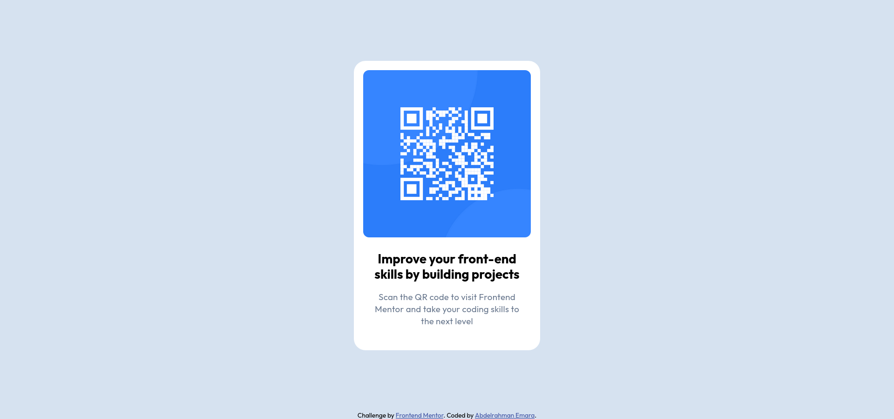
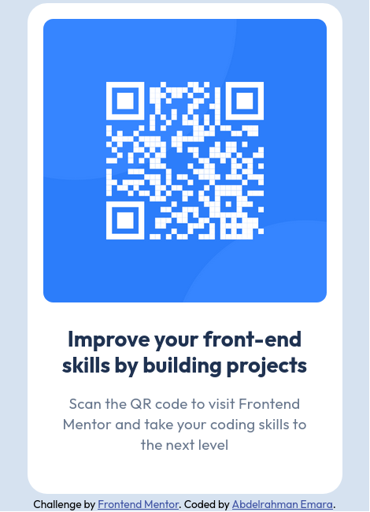

# Frontend Mentor - QR code component solution

This is a solution to the [QR code component challenge on Frontend Mentor](https://www.frontendmentor.io/challenges/qr-code-component-iux_sIO_H). Frontend Mentor challenges help you improve your coding skills by building realistic projects.

## Table of contents

- [Overview](#overview)
  - [Screenshot](#screenshot)
  - [Links](#links)
- [My process](#my-process)
  - [Built with](#built-with)
  - [What I learned](#what-i-learned)
  - [Continued development](#continued-development)
  - [Useful resources](#useful-resources)
- [Author](#author)
- [Acknowledgments](#acknowledgments)

**Note: Delete this note and update the table of contents based on what sections you keep.**

## Overview

### Screenshot




### Links

- Solution URL: [GitHub Solution URL](https://github.com/AAEmara/qr-code-component.git)
- Live Site URL: [QR-Code Component Live URL - Vercel](https://qr-code-iti.vercel.app/)

## My process

### Built with

- Semantic HTML5 markup
- CSS custom properties
- Flexbox

### What I learned

I practiced my skills on breaking down the main component structure into multiple `<div>` tags, where I could have a better control in styling them later:

```html
<div class="qr-component">
  <div class="qr-code">...</div>
  <div class="header-rectangle">
    <div class="header-content">...</div>
  </div>
</div>
```

I centered a `<div>` using `width` and `margin` properties:

```css
.header-content {
  width: 256px;
  margin: auto;
}
```

On top of that, I centered the whole body to be in the middle of the screen (Giving attention to the qr-component :) ), by using flexbox:

```css
body {
  ...;
  display: flex;
  flex-direction: column;
  justify-content: center;
  align-items: center;
  ...;
}
```

I used CSS Variables to get used to having a centralized control over the global styles of the HTML elements:

```css
:root {
  /* Colors */
  --white: hsl(0, 0%, 100%);
  --slate-900: hsl(218, 44%, 22%);
  --slate-500: hsl(216, 15%, 48%);
  --slate-300: hsl(212, 45%, 89%);
  --attribution-color: hsl(228, 45%, 44%);

  /* Fonts */
  --font-heading: 700 120% 0px;
  --font-paragraph: 400 140% 0.2px;
  --pargraph-size: 15px;
  --font-family-outfit: "Outfit", sans-serif;

  --card-shadow: 0px 25px 25px 0px rba(0, 0, 0 / 4.77%);
  --card-radius: 20px;
}
```

```js
const proudOfThisFunc = () => {
  console.log("🎉");
};
```

If you want more help with writing markdown, we'd recommend checking out [The Markdown Guide](https://www.markdownguide.org/) to learn more.

**Note: Delete this note and the content within this section and replace with your own learnings.**

### Continued development

I believe I can get better and learn more about the following topics, based on my experience with this project:

- Semantic HTML
- CSS Variables
- Flexbox and Grids
- Accessibility
- UI/UX Design Concpets
- Desgining UIs using Figma

### Useful resources

- [Example resource 1](https://www.example.com) - This helped me for XYZ reason. I really liked this pattern and will use it going forward.
- [Example resource 2](https://www.example.com) - This is an amazing article which helped me finally understand XYZ. I'd recommend it to anyone still learning this concept.

**Note: Delete this note and replace the list above with resources that helped you during the challenge. These could come in handy for anyone viewing your solution or for yourself when you look back on this project in the future.**

## Author

- Linkedin - [Abdelrahman Emara](https://www.linkedin.com/in/abdelrahman-emara/)
- Twitter - [@AplusEmara](https://www.twitter.com/AplusEmara)
- Frontend Mentor - [@aaemara](https://www.frontendmentor.io/profile/aaemara)
- GitHub - [AAEmara](https://github.com/AAEmara)

## Acknowledgments

I would like to thank the ITI FSP 25 (Full Stack Python 2025) mentors who inspired me to push my limits and enhance my frontend skills, through pursusing practical exercises and projects.
